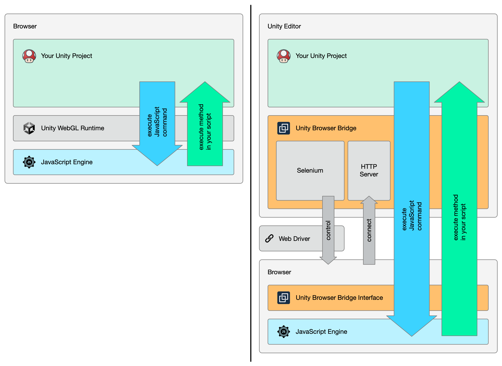
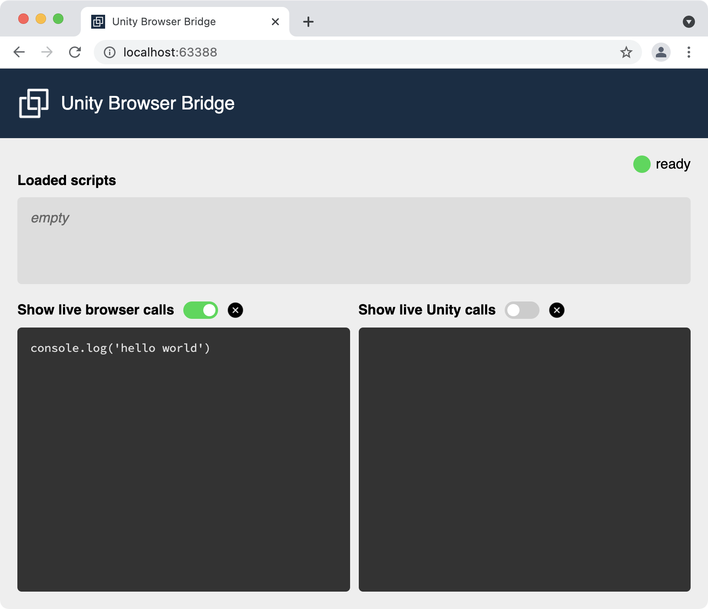
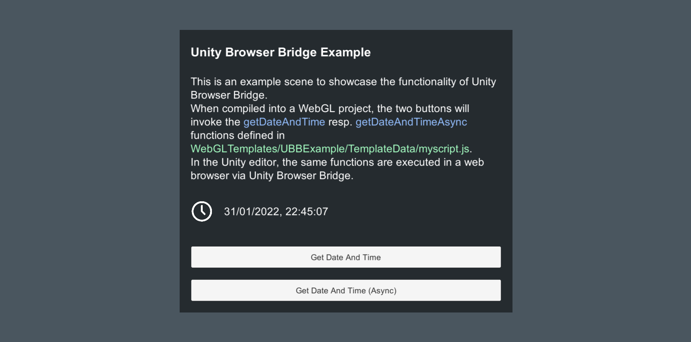
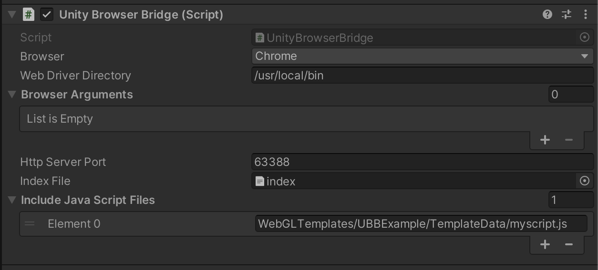
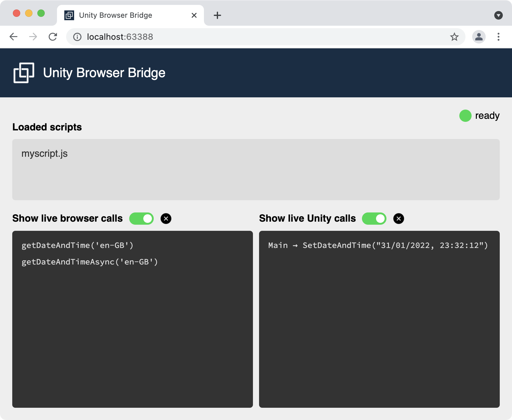
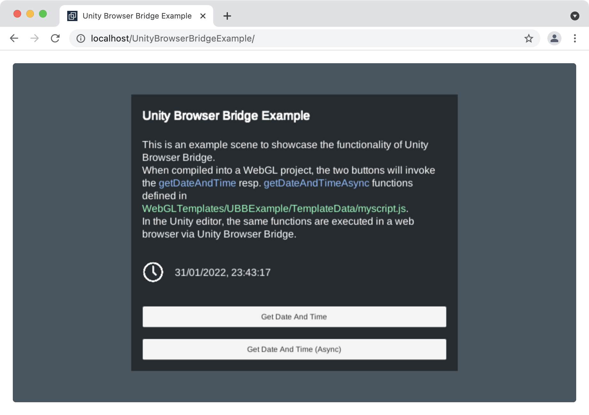

# Unity Browser Bridge

When building a Unity project for the web, you can interact with the web browser's JavaScript engine directly from your script code (see [WebGL: Interacting with browser scripting](https://docs.unity3d.com/Manual/webgl-interactingwithbrowserscripting.html)).

To test these browser interactions, you need to build the project and run it in the web browser. This can be rather time-consuming as compiling for WebGL tends to take a while.

Unity Browser Bridge (UBB) allows you to test browser interactions directly from the Unity editor.


## How does it work?

In a WebGL build, browser interaction is implemented by integrating the functions you defined in the _.jslib_ file into the your script code, which eventually gets translated into JavaScript. Similarly, the browser can invoke methods in your code using the SendMessage function on the Unity instance.

Within the Unity editor, there is no direct way of accessing a JavaScript engine present in web browsers. UBB therefore uses [Selenium WebDriver](https://www.selenium.dev/documentation/webdriver) to control a web browser with which your script code interacts.

The remote-controlled browser connects to a local HTTP server from where it loads an interface page including user-defined JavaScript files. Your script code then invokes the _ExecuteJS_ method with the JavaScript command to be executed in the browser. UBB instructs the web driver to execute the command and returns the result as return value (if there is any).

The interface page contains a mockup of the Unity instance (which would be present in a WebGL build) to emulate the _SendMessage_ function. When invoked, the _SendMessage_ function sends a request to the local HTTP server which forwards the message to the corresponding game object on the Unity side. Please note that, like in the real WebGL build, messages from the browser to your script code are unidirectional (i.e. they have no return values). Figure 1 gives a high-level overview of the components involved in the interaction between your project and the web browser.


_Figure 1: Overview of the interaction between your Unity project and the web browser when compiled into a WebGL build (left) and using Unity Browser Bridge in the Unity editor (right)._


## How do I use it?

#### Prerequisites

Here's what you need in order to use Unity Browser Bridge:

* Unity version 2021.1 or higher
* Unity project targeting the WebGL platform
* Web browser and its corresponding [web driver](https://www.selenium.dev/documentation/webdriver/getting_started/install_drivers)
* The Unity Browser Bridge package ([UnityBrowserBridge_v1.0.0.unitypackage](https://github.com/sropelato/UnityBrowserBridge/releases/download/v1.0.0/UnityBrowserBridge_v1.0.0.unitypackage))

#### Import Unity Browser Bridge

Import _UnityBrowserBridge_v1.0.0.unitypackage_ into your project. Drag the _UnityBrowserBridge_ prefab (in _UnityBrowserBridge/Prefabs_) into your scene. In the inspector, you can see the following following settings:

Setting | Description
--------|------------
Browser | The web browser which will be controlled by Unity Browser Bridge. The browser and the web driver must be installed for this to work.
Web Driver Directory | Path to the directory in which the web driver is located. If this is left empty, the web driver will be searched on your system's PATH.
HTTP Server Port | The port on which the local HTTP server will listen for connections.
Index file | The index file opened when the browser connects to Unity Browser Bridge. Changing this may result in UBB not woking properly.
Include JavaScript Files | Your JavaScript files included in the WebGL project. The path will first be resolved relative to the _Assets_ directory or, if not successful, as an absolute path.

#### Configure your script to use Unity Browser Bridge

Assume you want to execute a simple JavaScript command, for example ```console.log('hello world')```, from your script code. For this to work, you need to define this command in the _.jslib_ file. This could look something like this:

```
mergeInto(LibraryManager.library, {
    PrintHelloWorld: function() {
        console.log('hello world')
    }   
})
```

In your script code, you would then define the _PrintHelloWorld_ function like this:

```
[DllImport("__Internal")]
public static extern void PrintHelloWorld();
```

Now you can call ```PrintHelloWorld()``` from anywhere in your script code and it should execute the _console.log_ command above when compiled into a WebGL build.

To make it work in the editor, the _PrintHelloWorld()_ method needs to be changed as follows:

```
public static void PrintHelloWorld() {
    UnityBrowserBridge.Instance.ExecuteJS("console.log('hello world')");
}
```

If everything has been configured correctly, running your project in the Unity editor should open a browser window and display the UBB overview page. Turning on _Show live browser calls_ allows you to see the JavaScript commands that UBB executes in the browser, in this example, the ```console.log('hello world')``` command. 


_Figure 2: Unity Browser Bridge status page displayed in the remote-controlled web browser. It shows a list of included JavaScript files, if any, and a log of commands executed in the browser and messages sent from the browser to Unity. For performance reasons, both logs are disabled by default._

In a next step, you can use Unity's platform-dependent macros to avoid having to change the definition of the _PrintHelloWorld_ function every time you want to build your project:

```
#if UNITY_WEBGL && !UNITY_EDITOR
    [DllImport("__Internal")]
    public static extern void PrintHelloWorld();
#else
    public static void PrintHelloWorld() {
        UnityBrowserBridge.Instance.ExecuteJS("console.log('hello world')");
    }
#endif
```

With this in place, your project can be run in the Unity editor and compiled into a WebGL build, both with working browser interaction.


## The example project

The example project ([UnityBrowserBridgeExample_v1.0.0.unitypackage](https://github.com/sropelato/UnityBrowserBridge/releases/download/v1.0.0/UnityBrowserBridgeExample_v1.0.0.unitypackage)) contains a sample with a fully-configured UBB setup. It demonstrates how to invoke JavaScript functions with parameters and return types and how to handle function calls from the browser.

_Please note that the example project does not include the Unity Browser Bridge implementation. In order to work, the main package ___UnityBrowserBridge_v1.0.0.unitypackage___ must be imported as well._

#### Contents

The ___WebGLTemplates/UBBExample___ folder contains all files required to define a WebGL template which will be used when compiling the project to a WebGL build. The file ___TemplateData/myscript.js___ is included in the template and defines the functions _getDateAndTime_ and _getDateAndTimeAsync_ which return a formatted date string.

___Plugins/BrowserInteraction.json___ defines the two wrapper functions _GetDateAndTime_ and _GetDateAndTimeAsync_ which will invoke the JavaScript functions in _myscript.js_.

The controller (___Scripts/MainController.cs___) handles the calls to the wrapper functions (using UBB when run in the editor, or directly when compiled to WebGL).

The example scene (___Scenes/UnityBrowserBridgeExample.scene___) contains a simple UI with two buttons to display the current date (Figure 3), a game object with the _MainController_ script, and the _UnityBrowserBridge_ object (from _UnityBrowserBridge/Prefabs/UnityBrowserBridge.prefab_). Note that the _myscript.js_ file is listed under _Include JavaScript Files_.



_Figure 3: Unity Browser Bridge example project. Two buttons can be used to get and display the current date and time from the browser._


#### How to run the example project 

Configure Unity Browser Bridge to use the browser of your choice. Make sure the appropriate web driver is installed. If the executable is not on your system's PATH, set the directory containing the driver executable in _Web Driver Directory_ (Figure 4).

If configured correctly, a browser window displaying the UBB status page should appear when you enter play mode (Figure 5). Pressing the first button, _Get Date And Time_, invokes the _getDateAndTime_ function which directly returns the formatted date string. _Get Date And Time (Async)_ invokes _getDateAndTimeAsync_ respectively which invokes the _SetDateAndTime_ callback method in _MainController.cs_ (after a 1000 ms delay).

As in the _hello world_ example above, we use Unity's macros to make our code work in the WebGL build as well as in the editor. When compiled to WebGL, _GetDateAndTime_ and _GetDateAndTimeAsync_ are linked to the wrapper functions in _BrowserInteraction.json_. In the editor, they use Unity Browser Bridge instead. The example shows that ```ExecuteJS<T>()``` has a return type ```T``` while ```ExecuteJS()``` (without the diamond) has no return type:

```
...

#if UNITY_WEBGL && !UNITY_EDITOR

    [DllImport("__Internal")]
    public static extern string GetDateAndTime(string locale);
    [DllImport("__Internal")]
    public static extern void GetDateAndTimeAsync(string locale);

#else

    public static string GetDateAndTime(string locale) {
	    return UnityBrowserBridge.Instance.ExecuteJS<string>("getDateAndTime('" + locale + "')");
    }

    public static void GetDateAndTimeAsync(string locale) {
		UnityBrowserBridge.Instance.ExecuteJS("getDateAndTimeAsync('" + locale + "')");
	}

#endif

public void SetDateAndTime(string dateAndTimeString) {
    dateAndTimeText.text = dateAndTimeString;
    getDateAndTimeAsyncButton.interactable = true;
}

...

```


_Figure 4: Unity Browser Bridge configuration. The web driver executable (here chromedriver) is located in /usr/local/bin which is defined as the Web Driver Directory. The myscript.js file is listed to be included in the web project so its functions can be accessed by Unity Browser Bridge._


_Figure 5: Unity Browser Bridge status page of the example project with the included myscript.js file. Enabling the live calls shows the browser calls from Unity and the messages sent to Unity._

Of course, the example project can be built as a WebGL project and should show the same behavior like when tested in the Unity editor (Figure 6). Make sure to use the UBBExample WebGL template as it contains the required _myscript.js_ file.


_Figure 6: Example project compiled to WebGL._


## License

The source code, binaries and all included assets of Unity Browser Bridge are released under the [MIT license](LICENSE).

#### Included software

The Selenium framework (used to interact with the web driver) is licensed under the Apache 2.0 license (License file included in [Assets/UnityBrowserBridge/Plugins/SeleniumLicense.txt](Assets/UnityBrowserBridge/Plugins/SeleniumLicense.txt)).

jQuery (used in the example WebGL template) is licensed under the MIT license (License file included in [Assets/WebGLTemplates/UBBExample/TemplateData/jQueryLicense.txt](Assets/WebGLTemplates/UBBExample/TemplateData/jQueryLicense.txt)).
